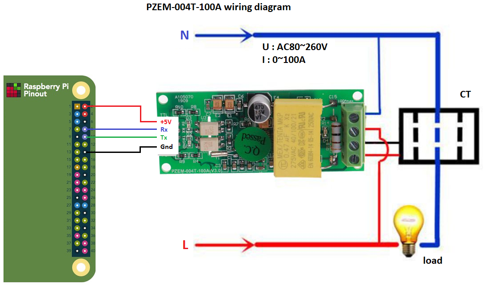

# PZEM-004T-v3 golang lib

Golang communication library for Peacefair PZEM-004T Energy monitor.

This module is equipped with TTL serial data communication interface, you can read and set the relevant parameters via the serial port.

## Assembly

For PI4 GPIO :
- pin 2 plugged on +5V
- pin 8 plugged on RX
- pin 10 plugged on TX
- pin 14 plugged on GND

have fun

